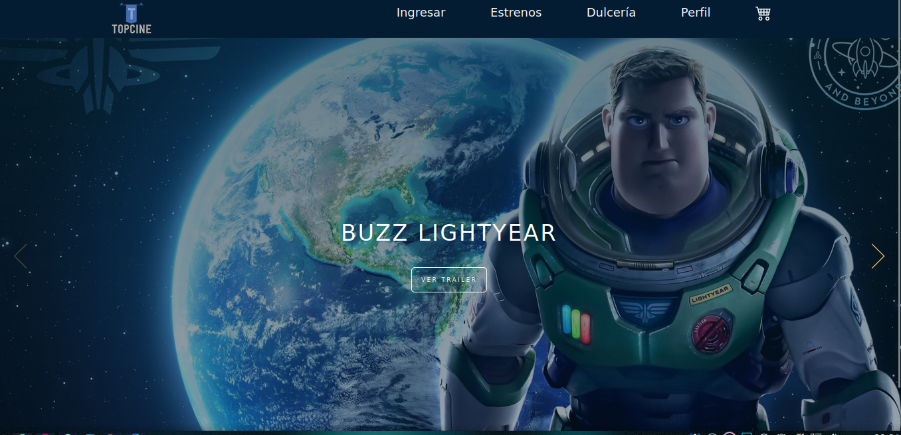

<p align="center">
  <a href="" rel="noopener">
 </a>
</p>

<h3 align="center">TopCine</h3>

<div align="center">

[]()
[](https://github.com/RickC1218/ProyectoIG2/issues)
[](https://github.com/RickC1218/ProyectoIG2/pulls)
[](/LICENSE)

</div>

---

<p align="center"> Descripción del desarrollo del modulo de los Estrenos populares
    <br> 
</p>

## 📝 Table of Contents

- [About](#about)
- [Getting Started](#getting_started)
- [Deployment](#deployment)
- [Usage](#usage)
- [Built Using](#built_using)
- [Authors](#authors)
- [Acknowledgments](#acknowledgement)

## 🧐 About <a name = "about"></a>

Aplicación web creada para la administración y gestion de compras de un cine. 

## 🏁 Getting Started <a name = "getting_started"></a>

These instructions will get you a copy of the project up and running on your local machine for development and testing purposes. See [deployment](#deployment) for notes on how to deploy the project on a live system.

### Prerequisites


- php 7.3 o superior en Debian-Based OS
```
$ sudo apt-get install php
```
- MySql 5.4 o superior en Debian-Based OS
```
$ sudo apt install mysql-server
```

### Installing

- Instalar NodeJS 16.16.0.0 LTS (Long Time Support Version) en Debian-Based OS 

```
$ sudo apt install curl
$ curl -fsSL https://deb.nodesource.com/setup_16.x | sudo -E bash -
$ sudo apt-get install -y nodejs
```

- Verificar Version de NodeJS y npm

```
$ Node --version
$ npm --version
```
- Clonar el Repositorio de git del proyecto

```
$ git clone https://github.com/RickC1218/ProyectoIG2.git
```
Demo del Proyecto:



## 🔧 Running the tests <a name = "tests"></a>

Explain how to run the automated tests for this system.

### Break down into end to end tests

Prueba de Conexio Base de datos:

```php
<?php
$servername = "localhost"; // Nombre/IP del servidor
$database = "topcine"; // Nombre de la BBDD
$username = "Carlos"; // Nombre del usuario
$password = "Linkcar_1999"; // Contraseña del usuario
// Creamos la conexión
$con = mysqli_connect($servername, $username, $password, $database);
// Comprobamos la conexión
if (!$con) {
    die("La conexión ha fallado: " . mysqli_connect_error());
}
echo "Conexión satisfactoria";
mysqli_set_charset($con,"utf8");
```

### And coding style tests

Explain what these tests test and why

```
Give an example
```

## 🎈 Usage <a name="usage"></a>

Add notes about how to use the system.

## 🚀 Deployment <a name = "deployment"></a>

Add additional notes about how to deploy this on a live system.

## ⛏️ Built Using <a name = "built_using"></a>

- [MySQL](https://www.mysql.com/) - Database
- [Xampp](https://www.apachefriends.org/) - Server
- [PHP](https://www.php.net/manual/es/index.php) - Backend
- [NodeJs](https://nodejs.org/en/) - Server Environment

## ✍️ Authors <a name = "authors"></a>

- [@RickC1218](https://github.com/RickC1218) - Ricardo Erazo
- [@Linkcar13](https://github.com/Linkcar13) - Carlos Estrada
- [@LeoAndrade-ux](https://github.com/LeoAndrade-ux) - Leonardo Andrade
- [@AlexanderG1999](https://github.com/AlexanderG1999) - Alexander Guillin


## 🎉 Acknowledgements <a name = "acknowledgement"></a>

- Hat tip to anyone whose code was used
- Inspiration
- References
